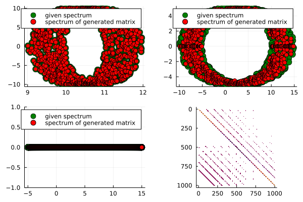

__SMG2S.jl__ is a Julia implementation of the __Scalable Matrix Generation with Given Spectrum (SMG2S)__. SMG2S was initially implemented based MPI (Message Passing Interface) and C++, which is able to generate very large-scale non-Hermitian/Symmetric matrices on modern supercomputers. For more details about this parallel implementation of SMG2S, click [here](https://github.com/SMG2S/SMG2S). The main target of the MPI/C++ implementation is its parallel performance on supercomputers, thus a lot constraints
were artificially posed, which leave very few space to be able to be customized by the users.

Different with the MPI/C++ version, this Julia implementation of SMG2S is introduced which is try to give as much as possible room to the users, who generate the matrices with different sparsity patterns.  

## Features

- Both **Non-Hermitian** and **Non-Symmetric**
- **Sparse** and **non-trivial**
- **Efficiency**: it is able to efficiently generate a very high dimension matrices
- **Given Spectrum**: their spectra must be known and can be customized
- **Controllable** Sparsity Patterns



## Installation

Currently, SMG2S.jl is only able to be installed from its github repository.

The command to install SMG2S.jl within Julia REPL (terminal) is

```julia
using Pkg;Pkg.add(PackageSpec(url="https://github.com/SMG2S/SMG2S.jl", rev="main"))
```

## Quick Example

```julia
using SMG2S

#Define size of matrix to be generated
size = 100

#maximum number of continous `1` in the diagonal of generated nilpotent matrix
nbOne = 4
#offsets of lower diagonals between which the matrix will be initially filled
diag_l = -20
diag_u = -5

#a function to generate the user-provided spectrum, `idx` is the indexing of eigenvalues
function f(idx::Integer, size = size)
    return 10 * cos(((idx-1) / 2) * 2 * π / size) + 5
end

#create a empty vector to store the generated eigenvalues
#Attention that this vector should always in complex scalar type
spec = zeros(ComplexF64, size)

#Setting up the spectrum with function `f`
Spectrum!(spec, f, size)

#Generating a non-symmetric sparse matrix and store it into `genMat`
genMat = nonsym(nbOne, size, diag_l, diag_u, spec)
```

## Credits

The following people are involved in the development of SMG2S:
- [Xinzhe Wu](https://github.com/brunowu) (main development and algorithms)
- [Serge Petiton](https://www.cristal.univ-lille.fr/~petiton/) (math and algorithms)
- Hervé Gachlier (maths)
- ...

If this project is useful for your work please consider
* [Citing](citing.md) the relevant paper
* Leaving a star on the [GitHub repository](https://github.com/SMG2S/SMG2S.jl)

## Contact

Any questions? Just send an email to [us](mailto:xin.wu@fz-juelich.de).
